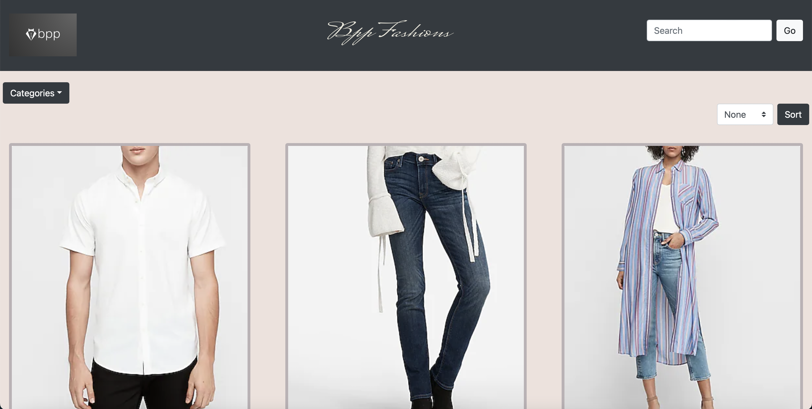
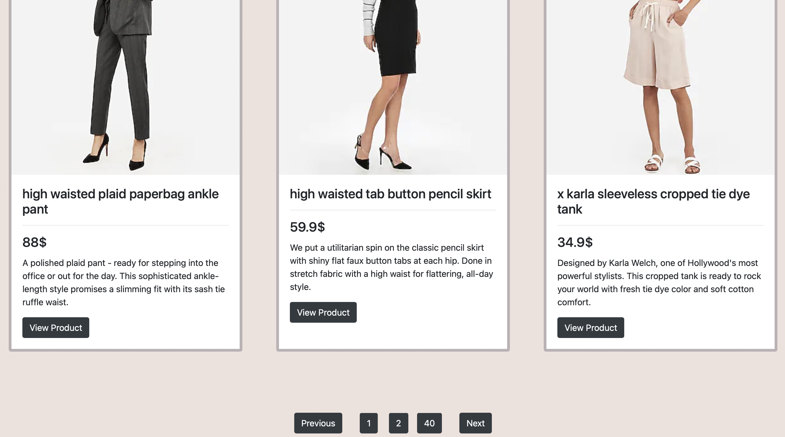
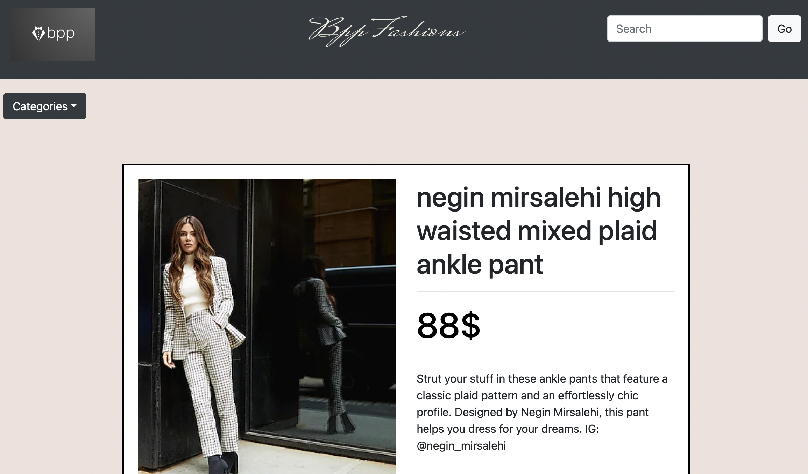

# BPP Fashions
An E-commerce website for a small business selling apparels.
It is powered by Unbxd Search while also having additional features such as Category Dropdowns,Pagination as well as Product Sort.The backend is developed on flask and the frontend is developed using html,css and javascript.

## Set Up

1. Create and activate virtual environment

Add ```.env``` file in ```flaskapp/```
```bash
python -m venv venv
source env/bin/activate
```

2. Install dependencies

```bash
pip3 install -r requirements.txt
```

3. Run the Flask App

```bash
python3 run.py
```

## Usage

1. General Information

    The app can be accessed at ```localhost:5000```

    API Specification can be found at ```localhost:5000/swagger-ui```

2. Pre-requisites
    - ```.env```: Contains environment variables.
    - ```out.json```: Contains catalog data.
    - ```SITE_KEY```: Authentication token for site owners. Replace {{SITE_KEY}} with the actual string in API endpoints.

3. Data Ingestion
    - Download ```out.json``` containing the data.
    - Upload the data to the app.
   ```
   curl --location -g --request POST 'localhost:5000/api/upload-catalog/{{SITE_KEY}}' \--form 'file=@"out.json"'
   ```
   Alternative to curl using python:
    ```
    import requests
    
   url = "localhost:5000/api/upload-catalog/{{SITE_KEY}}"
   
    payload={}
   
    files=[
    ('file',('out.json',open('out.json','rb'),'application/json'))
    ]
    
   headers = {}

    response = requests.request("POST", url, headers=headers, data=payload, files=files)

    print(response.text)
   ```

## Directory Structure
```
📦bpp_fashions
┣ 📂flaskapp
┃ ┣ 📂api
┃ ┣ ┣ 📂ingestion
┃ ┣ ┣ ┣ 📂CatalogProcessors
┃ ┣ ┣ 📂products
┃ ┣ 📂models
┃ ┣ 📂static
┃ ┣ 📂templates
```

## Website Screenshots

1.Homepage(Search,Category Dropdown,Sort)


2.Homepage(Pagination)


3.Product Page


## Note

1. Frontend is still being integrated. The UI might not work.
2. Backend APIs are all up and working.
3. All data is stored in ```site.db```. Any SQLite browser can be used to view the stored data.
4. Migration to PostgreSQL will be done during deployment.